## 🏗 High Level Architecture

## Meeting Creation Flow

## Join Meeting Flow

```mermaid
sequenceDiagram
    autonumber
    participant Client
    participant Kendra
    participant DB
    participant MediaServer

    Client->>Kendra: Join Meeting

    Kendra->>DB: Lookup meeting → mediaServer
    DB-->>Kendra: mediaServerId + routerId

    Kendra->>MediaServer: Fetch rtpCapabilities(routerId)

    MediaServer-->>Kendra: rtpCapabilities

    Kendra-->>Client: rtpCapabilities
```

## Recreate Producer / Consumer Transport Recreation (With Old Transport Cleanup)

## Create Consumer Flow

## Create Producer Flow (With Redis Notification)

